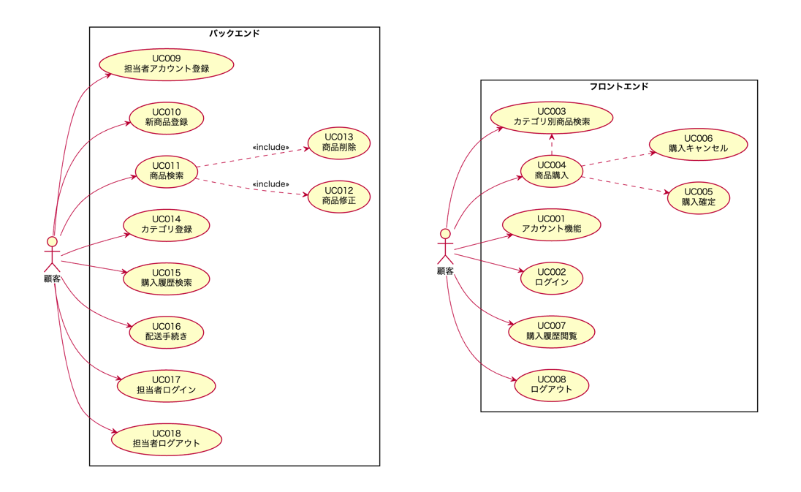
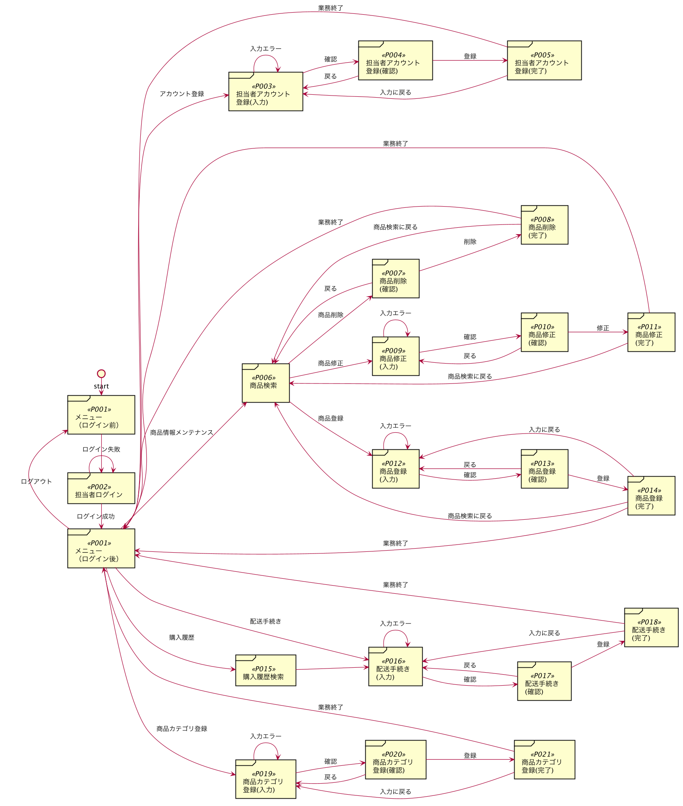
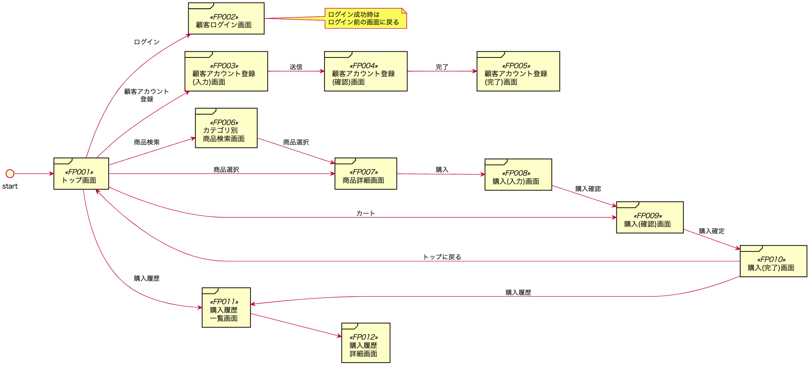
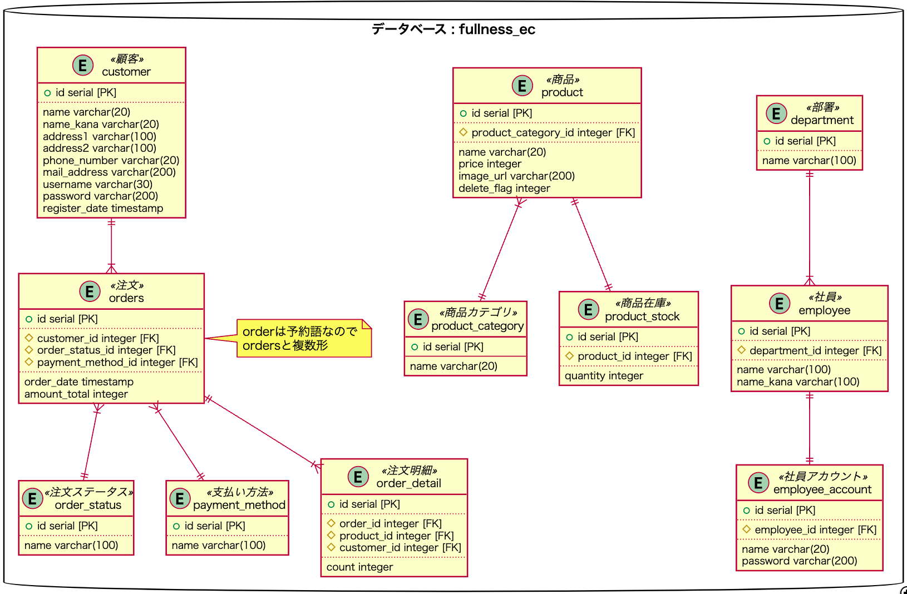

# Fullness Stationary社 文具/雑貨販売システム

## テストレポート

[https://fullness-java2022.github.io/fullness-ec-8](https://fullness-java2022.github.io/fullness-ec-8)

## 目次

  - [チームメンバー](#チームメンバー)
  - [チーム目標](#チーム目標)
  - [要件定義](#要件定義)
    - [システム名](#システム名)
    - [プロジェクト概要](#プロジェクト概要)
    - [ユースケース図](#ユースケース図)
  - [基本設計](#基本設計)
    - [機能一覧](#機能一覧)
    - [画面遷移](#画面遷移)
    - [画面一覧](#画面一覧)
  - [詳細設計](#詳細設計)
    - [ベースパッケージ名](#ベースパッケージ名)
    - [プロジェクト構成](#プロジェクト構成)
    - [ER図](#er図)
    - [クラス図](#クラス図)
    - [シーケンス図](#シーケンス図)
  - [開発フェーズについて](#開発フェーズについて)
  - [成果物](#成果物)
  - [設計・開発・納品の流れ](#設計開発納品の流れ)
  - [客先訪問、上司レビュー、上司報告時のルール](#客先訪問上司レビュー上司報告時のルール)
  - [日次の上司報告について](#日次の上司報告について)

## チームメンバー

- Aさん（チームリーダー）
- Bさん（テクニカルリーダー）
- Cさん
- Dさん
- Eさん

## チーム目標

TODO チーム目標を入れてください。

---

## 要件定義

### システム名

**Fullness Stationary社 文具/雑貨販売システム**

### プロジェクト概要

- Fullness Stationery社では自社が運営する店舗で文具、雑貨、パソコン周辺機器を販売しているが、他社ではECサイトを構築して売り上げを伸ばしている。
- そこで、自社でもECサイトを構築して売り上げを伸ばすことを決断した。システムは1次開発としてバックエンド向けのサイトを構築し、2次開発でフロントエンドのサイトを構築しようと考えている。

### ユースケース図



---

## 基本設計

### 機能一覧

#### フロントエンド機能

機能ID|機能名|説明
---|---|---
[UC001](plan/function/uc001.md) | 顧客アカウント登録 | 顧客がシステムを利用するための認証アカウントを登録する
[UC002](plan/function/uc002.md) | 顧客アカウントログイン | 顧客がシステムを利用する資格を有していることを認証によって確認する
[UC003](plan/function/uc003.md) | カテゴリ別商品検索 | 選択されたカテゴリに属する商品を一覧形式で表示する
[UC004](plan/function/uc004.md) | 商品購入 | 選択された商品の注文数を入力してカートに入れる
[UC005](plan/function/uc005.md) | 購入確定 | 支払い方法を選択して購入を確定する
[UC006](plan/function/uc006.md) | 購入キャンセル | カートの商品の一部またはすべてをキャンセルする
[UC007](plan/function/uc007.md) | 購入履歴閲覧 | 顧客の過去の購入履歴を一覧形式で表示する 
[UC008](plan/function/uc008.md) | 顧客アカウントログアウト | システムからログアウトする

#### バックエンド機能

機能ID|機能名|説明
---|---|---
[UC009](plan/function/uc009.md) | 担当者アカウント登録 | 担当者がシステムを利用するための認証アカウントを登録する
[UC010](plan/function/uc010.md) | 新商品登録 | 新しく販売する商品情報を登録する
[UC011](plan/function/uc011.md) | 商品検索 | 選択されたカテゴリに属する商品を一覧形式で表示する
[UC012](plan/function/uc012.md) | 商品修正 | [UC011](plan/function/uc011.md)の検索結果画面で選択された商品に関する情報を変更する
[UC013](plan/function/uc013.md) | 商品削除 | [UC011](plan/function/uc011.md)の検索結果画面で選択された商品に関する情報を削除する
[UC014](plan/function/uc014.md) | 商品カテゴリ登録 | 新しい商品カテゴリを登録する
[UC015](plan/function/uc015.md) | 購入履歴検索 | 購入日または顧客のアカウントで購入履歴を検索する
[UC016](plan/function/uc016.md) | 配送手続き | 配送した商品のステータスを変更する
[UC017](plan/function/uc017.md) | 担当者ログイン | システムを利用する資格を有している担当者かを認証によって確認する
[UC018](plan/function/uc018.md) | 担当者ログアウト | システムからログアウトする

### 画面遷移

#### バックエンド



#### フロントエンド



### 画面一覧

#### バックエンド

画面ID | 画面名
---|---
[P001](plan/function/menu.md) | メニュー画面
[P002](plan/function/uc017.md) | 担当者ログイン画面
[P003](plan/function/uc009.md) | 担当者アカウント登録(入力)画面
[P004](plan/function/uc009.md) | 担当者アカウント登録(確認)画面
[P005](plan/function/uc009.md) | 担当者アカウント登録(完了)画面
[P006](plan/function/uc011.md) | 商品検索画面
[P007](plan/function/uc013.md) | 商品削除(確認)画面
[P008](plan/function/uc013.md) | 商品削除(完了)画面
[P009](plan/function/uc012.md) | 商品修正(入力)画面
[P010](plan/function/uc012.md) | 商品修正(確認)画面
[P011](plan/function/uc012.md) | 商品修正(完了)画面
[P012](plan/function/uc010.md) | 新商品登録(入力)画面
[P013](plan/function/uc010.md) | 新商品登録(確認)画面
[P014](plan/function/uc010.md) | 新商品登録(完了)画面
[P015](plan/function/uc015.md) | 購入履歴検索画面
[P016](plan/function/uc016.md) | 配送手続き(入力)画面
[P017](plan/function/uc016.md) | 配送手続き(確認)画面
[P018](plan/function/uc016.md) | 配送手続き(完了)画面
[P019](plan/function/uc014.md) | 商品カテゴリ登録(入力)画面
[P020](plan/function/uc014.md) | 商品カテゴリ登録(確認)画面
[P021](plan/function/uc014.md) | 商品カテゴリ登録(完了)画面
[P000](plan/function/error.md) | エラー画面

#### フロントエンド

画面ID | 画面名
---|---
[FP001](plan/function/frontend-top.md) | トップ画面
[FP002](plan/function/uc002.md) | 顧客ログイン画面
[FP003](plan/function/uc001.md) | 顧客アカウント登録(入力)画面
[FP004](plan/function/uc001.md) | 顧客アカウント登録(確認)画面
[FP005](plan/function/uc001.md) | 顧客アカウント登録(完了)画面
[FP006](plan/function/uc003.md) | カテゴリ商品検索画面
[FP007](plan/function/uc004.md) | 商品詳細画面
[FP008](plan/function/uc004.md) | 購入(入力)画面
[FP009](plan/function/uc005.md) | 購入(確認)画面
[FP010](plan/function/uc005.md) | 購入(完了)画面
[FP011](plan/function/uc007.md) | 購入履歴一覧画面
[FP012](plan/function/uc007.md) | 購入履歴詳細画面
FP000 | エラー画面

---

## 詳細設計

### ベースパッケージ名

- `com.fullness.ec`

### プロジェクト構成

下記のプロジェクト構成は全チーム統一します。

```
├── build.gradle
├── src
│   ├── main
│   │   ├── java
│   │   │   └── com
│   │   │       └── fullness
│   │   │           └── ec
│   │   │               ├── EcApplication.java
│   │   │               ├── config
│   │   │               |   └── （コンフィグクラス）
│   │   │               ├── aop
│   │   │               |   └── （AOPクラス）
│   │   │               ├── service
│   │   │               |   └── （サービスクラス）
│   │   │               ├── controller
│   │   │               |   └── （コントローラークラス）
│   │   │               ├── entity
│   │   │               |   └── （エンティティクラス）
│   │   │               ├── repository
│   │   │               |   └── （リポジトリクラス）
│   │   │               ├── form
│   │   │               |   └── （フォームクラス）
│   │   │               └── security
│   │   │                   └── （Spring Security関連クラス）
│   │   └── resources
│   │       ├── ValidationMessages.properties
│   │       ├── application.properties
│   │       ├── com
│   │       │   └── fullness
│   │       │       └── ec
│   │       │           └── repository
│   │       ├── db
│   │       │   ├── create_table.sql
│   │       │   └── create_user.sql
│   │       ├── messages.properties
│   │       └── templates
│   │           └── （テンプレートファイル）
│   └── test
│       └── java
│           └── com
│               └── fullness
│                   └── com
│                       ├── EcApplicationTests.java
│                       ├── entity
│                       │   └── （エンティティのテストクラス）
│                       ├── repository
│                       │   └── （リポジトリのテストクラス）
│                       └── service
│                           └── （サービスのテストクラス）
├── doc
│   └── （JavaDoc生成）
├── plan
│   ├── db
│   │   ├── db.sql <-- DB&ユーザ定義(DB名:fullness_ec ユーザ･パスワード:fullness_ec)
│   │   ├── schema.sql  <-- テーブル定義SQL
│   │   └── data.sql  <-- 初期データSQL
│   ├── er
│   │   ├── er.png
│   │   └── er.puml
│   ├── function
│   │   └── 機能詳細マークダウンファイル
│   ├── img
│   │   └── 画像素材ファイル一式
│   ├── uml
│   │   ├── usecase
│   │   │   ├── usecase.png <-- ★ユースケース図画像
│   │   │   └── usecase.plantuml <-- ★ユースケース図plantumlファイル
│   │   ├── er
│   │   │   ├── er.png <-- ★ER図画像
│   │   │   └── er.plantuml <-- ★ER図plantumlファイル
│   │   ├── class
│   │   │   ├── class-overview.png <-- 概要クラス図画像ファイル
│   │   │   ├── class-overview.plantuml <-- 概要クラス図画像ファイルplantumlファイル
│   │   │   ├── class-detail-controller.png <-- 詳細クラス図（controllerパッケージ）画像ファイル
│   │   │   ├── class-detail-controller.plantuml <-- 詳細クラス図（controllerパッケージ）plantumlファイル
│   │   │   ├── class-detail-service.png <-- 詳細クラス図（serviceパッケージ）画像ファイル
│   │   │   ├── class-detail-service.plantuml <-- 詳細クラス図（serviceパッケージ）plantumlファイル
│   │   │   ├── class-detail-config.png <-- 詳細クラス図（configパッケージ）画像ファイル
│   │   │   ├── class-detail-config.plantuml <-- 詳細クラス図（configパッケージ）plantumlファイル
│   │   │   ├── class-detail-aop.png <-- 詳細クラス図（aopパッケージ）画像ファイル
│   │   │   ├── class-detail-aop.plantuml <-- 詳細クラス図（aopパッケージ）plantumlファイル
│   │   │   ├── class-detail-form.png <-- 詳細クラス図（formパッケージ）画像ファイル
│   │   │   ├── class-detail-form.plantuml <-- 詳細クラス図（formパッケージ）plantumlファイル
│   │   │   ├── class-detail-security.png <-- 詳細クラス図（securityパッケージ）画像ファイル
│   │   │   ├── class-detail-security.plantuml <-- 詳細クラス図（securityパッケージ）plantumlファイル
│   │   │   ├── class-detail-entity.png <-- 詳細クラス図（entityパッケージ）画像ファイル
│   │   │   ├── class-detail-entity.plantuml <-- 詳細クラス図（entityパッケージ）plantumlファイル
│   │   │   ├── class-detail-repository.png <-- 詳細クラス図（repositoryパッケージ）画像ファイル
│   │   │   └── class-detail-repository.plantuml <-- 詳細クラス図（repositoryパッケージ）plantumlファイル
│   │   └── sequence
│   │       ├── sequence-uc001.png <-- UC001 顧客アカウント登録機能のシーケンス図画像ファイル
│   │       ├── sequence-uc001.plantuml <-- UC001 顧客アカウント登録機能シーケンス図plantumlファイル
│   │       （省略）
│   │       ├── sequence-uc018.png <-- UC018 担当者アカウントログアウト機能シーケンス図画像ファイル
│   │       └── sequence-uc018.plantuml <-- UC018 担当者アカウントログアウト機能シーケンス図plantumlファイル
│   ├── test
│   │   ├── 単体テスト.xlsx <-- 単体テスト仕様書
│   │   └── 結合テスト.xlsx <-- 結合テスト仕様書
│   ├── wbs
│   │   └── wbs.xlsx
│   └── etc
│       ├── ソースファイル一覧
│       └── （その他チームで作成したもの）
├── README.md
└── .gitignore
```

### ER図



[SQLはこちら](plan/db)

### クラス図

#### パッケージ全体

TODO plantumlで作成した概要クラス図を画像として表示する事

#### configパッケージ

TODO plantumlで作成した詳細クラス図を画像として表示する事

#### controllerパッケージ

TODO plantumlで作成した詳細クラス図を画像として表示する事

#### formパッケージ

TODO plantumlで作成した詳細クラス図を画像として表示する事

#### serviceパッケージ

TODO plantumlで作成した詳細クラス図を画像として表示する事

#### repositoryパッケージ

TODO plantumlで作成した詳細クラス図を画像として表示する事

#### entityパッケージ

TODO plantumlで作成した詳細クラス図を画像として表示する事

#### formパッケージ

TODO plantumlで作成した詳細クラス図を画像として表示する事

#### securityパッケージ

TODO plantumlで作成した詳細クラス図を画像として表示する事

### シーケンス図

#### UC001 顧客アカウント登録機能

TODO plantumlで作成したシーケンス図を画像として表示する事

#### UC002 顧客アカウントログイン機能

TODO plantumlで作成したシーケンス図を画像として表示する事

#### UC003 カテゴリ別商品機能

TODO plantumlで作成したシーケンス図を画像として表示する事

#### UC004 商品購入機能

TODO plantumlで作成したシーケンス図を画像として表示する事

#### UC005 購入確定機能

TODO plantumlで作成したシーケンス図を画像として表示する事

#### UC006 購入キャンセル機能

TODO plantumlで作成したシーケンス図を画像として表示する事

#### UC007 購入履歴閲覧

TODO plantumlで作成したシーケンス図を画像として表示する事

#### UC008 顧客アカウントログアウト

TODO plantumlで作成したシーケンス図を画像として表示する事

#### UC009 担当者アカウント登録機能

TODO plantumlで作成したシーケンス図を画像として表示する事

#### UC010 新商品登録機能

TODO plantumlで作成したシーケンス図を画像として表示する事

#### UC011 商品検索機能

TODO plantumlで作成したシーケンス図を画像として表示する事

#### UC012 商品修正機能

TODO plantumlで作成したシーケンス図を画像として表示する事

#### UC013 商品削除機能

TODO plantumlで作成したシーケンス図を画像として表示する事

#### UC014 商品カテゴリ登録機能

TODO plantumlで作成したシーケンス図を画像として表示する事

#### UC017 担当者アカウントログイン機能

TODO plantumlで作成したシーケンス図を画像として表示する事

#### UC018 担当者アカウントログアウト機能

TODO plantumlで作成したシーケンス図を画像として表示する事

---

## 開発フェーズについて

### 初期開発フェーズ

初期開発フェーズとして下記機能を開発する。

＜バックエンド機能＞

- [UC009（担当者アカウント登録）](plan/function/uc009.md)
- [UC010（新商品登録）](plan/function/uc010.md)
- [UC011（商品検索）](plan/function/uc011.md)
- [UC012（商品修正）](plan/function/uc012.md)
- [UC013（商品削除）](plan/function/uc013.md)
- [UC014（カテゴリ登録）](plan/function/uc0014.md)
- [UC017（担当者ログイン）](plan/function/uc017.md)
- [UC018（担当者ログアウト）](plan/function/uc018.md)

### 次期開発フェーズ

次期開発フェーズとして下記機能（残り全て）を開発する。

＜バックエンド機能＞

- [UC015](plan/function/uc015.md)（購入履歴検索）
- [UC016](plan/function/uc016.md)（配送手続き）

＜フロントエンド機能＞

- [UC001](plan/function/uc001.md)（アカウント登録）
- [UC002](plan/function/uc002.md)（ログイン）
- [UC003](plan/function/uc003.md)（カテゴリ別商品検索）
- [UC004](plan/function/uc004.md)（商品購入）
- [UC005](plan/function/uc005.md)（購入確定）
- [UC006](plan/function/uc006.md)（購入キャンセル）
- [UC007](plan/function/uc007.md)（購入履歴閲覧）
- [UC008](plan/function/uc008.md)（ログアウト）

---

## 成果物

### 初期開発フェーズ

初期開発フェーズの納品時に下記を成果物として提出する。

- クラス図
  - 概要クラス図（全体）
  - 詳細クラス図（パッケージ毎）
- シーケンス図
  - UC009〜UC018（UC015〜UC017を除く）
- ソース・ファイル一覧
- テスト仕様書
  - 単体テスト
    - Repository
    - Service
    - Entity
  - 結合テスト
    - ブラックボックステスト
    - 画面毎にシートを作成
      - 表示項目の確認
      - 入力・出力の確認
      - 画面遷移の確認
- ソースコード
- テストプログラム（JUnitでの単体テストコード）
- Javadocドキュメント
- jarファイル（リリース時）

### 次期開発フェーズ

初期開発フェーズの納品時に下記を成果物として提出する。

- クラス図
  - 概要クラス図（全体）
  - 詳細クラス図（パッケージ毎）
- シーケンス図
  - 初期開発フェーズで作成したシーケンス図以外すべて
- ソース・ファイル一覧
- テスト仕様書
  - 単体テスト
    - Repository
    - Service
    - Entity
  - 結合テスト
    - ブラックボックステスト
    - 画面毎にシートを作成
      - 表示項目の確認
      - 入力・出力の確認
      - 画面遷移の確認
- ソースコード
- テストプログラム（JUnitでの単体テストコード）
- Javadocドキュメント
- jarファイル（リリース時）
- 発表資料

---

## 設計・開発・納品の流れ

1. 要求、要件の確認
    - 要件定義、基本設計書などの読み込み、仕様を理解する
    - 不明な点や確認したい点を纏める
        - 次の「客先訪問」で質問する内容を洗い出す
2. 客先訪問
    - お客様に訪問し仕様・要件の確認を行う
        - お客様の認識と齟齬がないかをしっかり確認する
3. 詳細設計
    - クラス図、シーケンス図、単体テスト仕様書、結合テスト仕様書を作成
    - 作成し、チーム内でのレビューが完了したら上司レビューを行う
4. 開発
    - 設計書を見ながら作業分担し実装を行う
    - 単体テストは並行して行う
5. 上司の最終チェック
    - 全ての成果物が完成し、単体テスト、結合テストも終わり、その他の成果物も揃い、チーム内でレビューし問題ないと判断した場合は上司に連絡する
    - こちらも20分前に上司にSlackに連絡をとりレビュー予約をとる
6. 納品
    - 上司の最終チェックが終了したら納品作業を行う
    - ソースコードはjarファイルにアーカイブ化しGithubのリリースファイルとしてアップロードする
7. 新規開発
    - 1次フェーズの納品が完了

---

## 客先訪問、上司レビュー、上司報告時のルール

**レビュー前**

- レビュー希望時間の20分前には上司にSlackに連絡をとりレビュー予約をとる
- レビューまでにはレビューする対象の成果物はGithubにプッシュする
    - ソースコードの場合は**必ずSpringBootが起動する状態にすること**
    - お客に見せても恥ずかしくないよう成果物は綺麗で見やすい状態にする

**レビュー時**

- 相手に対して話す内容を簡潔にわかりやすく説明する
- 相手が発言した内容をしっかりメモをとる

## 日次の上司報告について

- 毎日16時には上司レビューを行います（10分程度）
- WBSを見せながら主に進捗状況について上司に報告する
- 上司の発言した内容はしっかりメモをとる

## チームで解決できないことが発生したとき

- まずはインターネットを使って解決したいことについてGoogle検索を行なってみて解決できないか調査してください
- それでも解決できない場合はGithubリポジトリのissueを使って上司に状況を報告してください
  - [【NotePM】Githubでissueを登録する](https://fullness.notepm.jp/page/a01ad3f57d)
