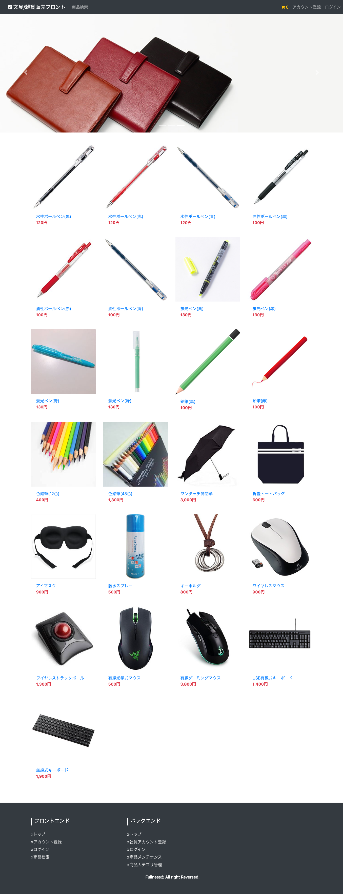

# トップ画面

## 画面仕様

- 次のようにヘッダーの下にキャッチ画像を[インジケータ付きのカルーセル](https://getbootstrap.jp/docs/4.3/components/carousel/#with-indicators)で表示させる
  - キャッチ画像は`plan/img`の中の下記画像を利用する
    - `catch01.png`
    - `catch02.png`
    - `catch03.png`
- キャッチ画像のカルーセルの下は前商品を1行4列(*)で表示させる
  - 出来ればレスポンシブデザインで下記ルールで表示させる
    - PC画面なら1行4列
    - タブレット画面なら1行3列
    - スマホ画面なら1行1列

### PC画面

