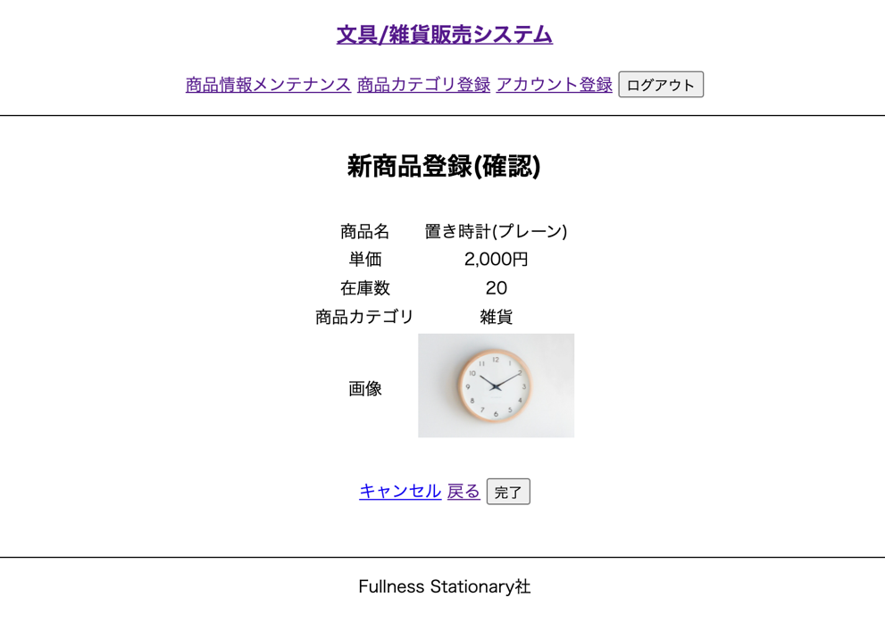
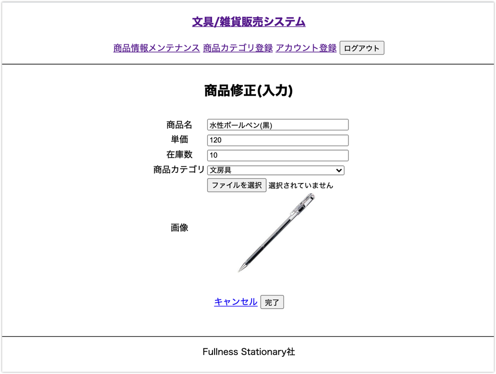
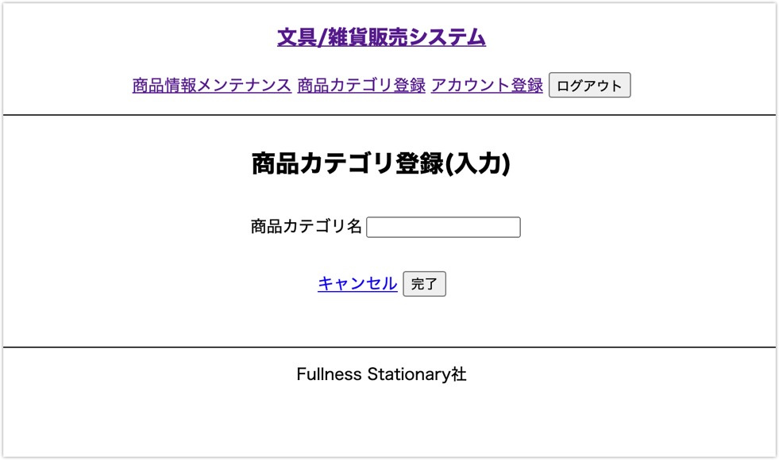
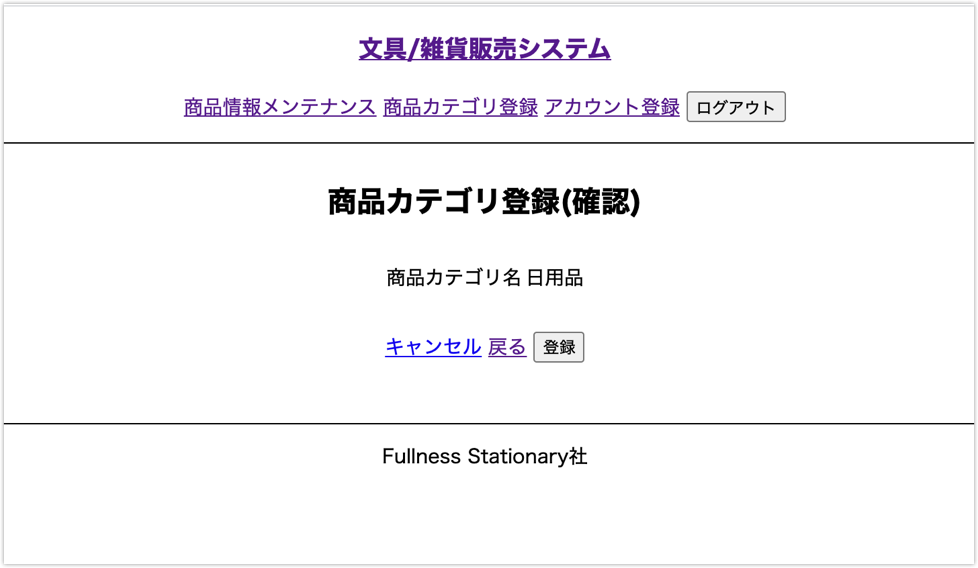

# 画面仕様（バックエンド）

## メニュー画面

## UC009 担当者アカウント登録機能

### 概要

担当者がシステムを利用するために必要な情報をシステムに登録する

### 事前条件

特になし

### イベントフロー

1. 担当者は「担当者アカウント登録」を選択する
2. システムは「アカウント登録(入力)」画面を表示する
3. 担当者はアカウント登録する社員を選択する
4. 担当者は登録に必要な情報を画面に入力して「完了」ボタンを押下する
5. システムは「アカウント登録(確認)」画面を表示する
6. 担当者は入力内容に間違いが無ければ「登録」ボタンを押下する
7. システムはアカウント用IDを新規に発行しパスワードをハッシュ値化してシステムに登録する
8. システムは「アカウント登録(完了)」画面を表示する
9. ユースケース終了

### 代替フロー

- 6のイベントフローにおいて入力に誤りがあった場合「戻る」ボタン押下で「アカウント登録(入力)」 画面に戻る
- 担当者はイベントフロー3を再度実行する

### 事後条件

UC017【担当者ログイン】でログイン認証してシステムを利用することが可能になる

### 例外シナリオ:

- イベントフロー4において入力内容が備考の制約に違反した場合はエラーメッセージを画面に表示して再度入力を促す

### 備考

**入力値の制約**

項目|必須|文字数|文字種
---|---|---|---
社員名|◯|―|-
アカウント名|◯|5〜20文字|英数字
パスワード|◯|4〜10文字|英数字
         
### 担当者アカウント登録（入力）画面

### 担当者アカウント登録（確認）画面

### 担当者アカウント登録（完了）画面

## UC010 新商品追加機能

### 概要

新しい商品の情報をシステムに登録する

### 事前条件

UC017【担当者ログイン】が終了している

### イベントフロー

1. 担当者は「商品情報メンテナンス」を選択する
2. システムは「商品情報メンテナンス」画面を表示する
3. 担当者は「新商品登録」ボタンを押下する
4. システムは「新商品登録(入力)」画面を表示する
5. 担当者は必要な情報を入力画面に入力して「完了」ボタンを押下する 6. システムは「新商品登録(確認)」画面を表示する
6. 担当者は入力内容を確認して「登録」ボタンを押下する
7. システムは商品IDを発行し新商品をシステムに登録する
8. システムは「新商品登録(完了)」画面を表示する
9. ユースケース終了

### 代替フロー

- イベントフロー7において入力に誤りがあった場合「戻る」ボタン押下で「新商品登録(入力)」画面に戻る
- 担当者はイベントフロー5を再度実行する

### 事後条件

UC011【商品検索】で登録した新商品を確認することができる

### 例外シナリオ

- イベントフロー5において入力内容が備考の制約に違反した場合はエラーメッセージを画面に表示して再度入力を促す

### 備考

#### 入力値の制約

項目|必須|文字数|文字種
---|---|---|---
商品名|◯|5〜20文字|全角文字、半角英数字
単価|◯|4〜10文字|数字
在庫数|◯|0〜1000000|数字 
商品カテゴリ|◯|-|-
画像|◯|-|-

#### 単価の制約

カテゴリ別に商品単価は以下の制約条件になる

商品カテゴリ|単価
---|---
文房具|30円〜5000円
雑貨|100円〜10000円
パソコン周辺機器|300円〜30000円

### 新商品登録(入力)画面

### 新商品登録(確認)画面

### 新商品登録(完了)画面

## UC011 商品検索

### 概要

選択された商品カテゴリに属する商品を一覧表示する

### 事前条件

UC017【担当者ログイン】が終了している

### イベントフロー

1. 担当者は「商品情報メンテナンス」を選択する
2. システムは「商品情報メンテナンス」画面を表示する
3. 担当者は「商品カテゴリ」を選択し「検索」ボタンを押下する
4. システムは検索結果を一覧表示する
5. ユースケース終了

### 代替フロー
 
なし

### 事後条件

なし

### 例外シナリオ

なし

### 備考

なし

### 商品検索画面

---

## UC012 商品修正

### 概要

選択された商品の内容を変更する

### 事前条件

UC017【担当者ログイン】が終了している UC011【商品検索】で商品の一覧が表示されている

### イベントフロー

1. 担当者は変更対象の商品情報の「変更」ボタンを押下する
2. システムは「商品修正(入力)」画面を表示する
3. 担当者は変更項目を入力して「完了」ボタンを押下する
4. システムは「商品修正(確認)」画面を表示する
5. 担当者は変更内容を確認して「登録」ボタンを押下する
6. システムは商品情報を入力された内容で変更し「商品修正(完了)」画面を表示する
7. ユースケース終了

### 代替フロー

- イベントフロー5.において変更に誤りがあった場合「戻る」ボタン押下で「商品修正(入力)」画面 に戻る
- 担当者はイベントフロー3を再度実行する

### 事後条件

なし

### 例外シナリオ

- イベントフロー3おいて入力内容が備考の制約に違反した場合はエラーメッセージを画面に表示して再度入力を促す

### 備考

入力に関する制約はUC010と同じ

### 商品修正（入力）画面

### 商品修正（確認）画面

### 商品修正（完了）画面

---

## UC013 商品削除

### 概要

選択された商品を削除する

### 事前条件

UC017【担当者ログイン】が終了している UC011【商品検索】で商品の一覧が表示されている

### イベントフロー

1. 担当者は削除対象の商品情報の「削除」ボタンを押下する
2. システムは「商品削除(確認)」画面を表示する
3. 担当者は内容を確認して「削除」ボタンを押下する
4. システムは商品を削除し「商品削除(完了)」画面を表示する
5. ユースケース終了

### 代替フロー

なし

### 事後条件

なし

### 例外シナリオ

なし

### 備考

商品情報は過去の履歴検索等で利用するため物理削除は行わない

### 商品削除(確認)画面

### 商品削除(完了)画面

---

## UC014 商品カテゴリ登録

### 概要

新しい商品カテゴリを登録する

### 事前条件

UC017【担当者ログイン】が終了している

### イベントフロー

1. 担当者は「カテゴリ登録」を選択する
2. システムは「カテゴリ登録(入力)」画面を表示する
3. 担当者はカテゴリ名を入力して「完了」ボタンを押下する
4. システムは「カテゴリ登録(確認)」画面を表示する
5. 担当者は入力内容を確認して「登録」ボタンを押下する
6. システムはカテゴリIDを発行しカテゴリをシステムに登録する
7. システムは「カテゴリ登録(確認)」画面を表示する
8. ユースケース終了

### 代替フロー

- イベントフロー5.において入力に誤りがあった場合「戻る」ボタン押下で「カテゴリ登録(入力)」 画面に戻る
- 担当者はイベントフロー3.を再度実行する

### 事後条件

UC011【商品検索】で登録されたカテゴリを選択することができる

### 例外シナリオ

- イベントフロー3.において入力内容が備考の制約に違反した場合はエラーメッセージを画面に表示して再度入力を促す

### 備考

**入力値の制約**

項目|必須|文字数|文字種
---|---|---|---
カテゴリ名|◯|5〜20文字|全角半角英数字

### 商品カテゴリ登録(入力)画面

### 商品カテゴリ登録(確認)画面

### 商品カテゴリ登録(完了)画面

---

## UC015 購入履歴検索

### 概要

検索条件に一致する購入履歴を検索し一覧表示する

### 事前条件

UC017【担当者ログイン】が終了している

### イベントフロー

1. 担当者は「購入履歴」を選択する
2. システムは「購入履歴検索」画面を表示する
3. 担当者は「購入日」又は「アカウント」のいずれかまたは両方を入力して「検索」ボタンを押下する
4. システムは条件に一致する購入情報を検索して一覧表示する
5. ユースケース終了

### 代替フロー

なし

### 事後条件

なし

### 例外シナリオ

- イベントフロー4において対象データがなかった場合データがないことを表すメッセージを表示する

### 備考

なし

---

## UC016 配送手続き

### 概要

配送が完了した注文のステータスを配送済みに変更する

### 事前条件

UC017【担当者ログイン】が終了している

### イベントフロー

1. 担当者は「配送手続き」を選択する
2. システムは「配送手続き」画面を表示する
3. 担当者は注文番号を入力して「検索」ボタンを押下する
4. システムは入力された注文番号と一致する注文情報を検索して表示する
5. 担当者はステータスを「配送済み」に変更して「完了」ボタンを押下する
6. システムは該当の注文情報のステータスを上書きする
7. ユースケース終了

### 代替フロー

なし

### 事後条件

なし

### 例外シナリオ

- イベントフロー4において対象データがなかった場合データがないことを表すメッセージを表示する

### 備考

なし

---

## UC017 担当者ログイン

### 概要

担当者がシステムを利用する権限を有しているか認証する

### 事前条件

UC009【担当者アカウント登録】が終了している

### イベントフロー

1. 担当者は「ログイン」を選択する
2. システムは「ログイン」画面を表示する
3. 担当者は「アカウント名」と「パスワード」を入力して「ログイン」ボタンを押下する
4. システムは入力された「アカウント名」と「パスワード」で認証処理を行い「メニュー(ログイン後)」画面を表示する
5. ユースケース終了

### 代替フロー

なし

### 事後条件

他のユースケースをメニューから選択できる

### 例外シナリオ

- イベントフロー3において「アカウント名」又は「パスワード」のいずれか、又は両方が未入力の場合、エラーメッセージを画面に表示し再入力を促す
- イベントフロー4において「アカウント名」又は「パスワード」のいずれか又は両方が間違っていた場合、エラーメッセージを画面に表示し再入力を促す

### 備考

1. 入力の制約条件 UC009 と同じ

### 担当者ログイン画面

---

## UC018 担当者ログアウト

### 概要

システムをログアウトする

### 事前条件

UC017【担当者ログイン】が終了している

### イベントフロー

1. 担当者は「ログアウト」を選択する
2. システムはログアウト処理を行い「メニュー(ログイン前)」画面を表示する
3. ユースケース終了

### 代替フロー

なし

### 事後条件

なし

### 例外シナリオ

なし

### 備考

なし
