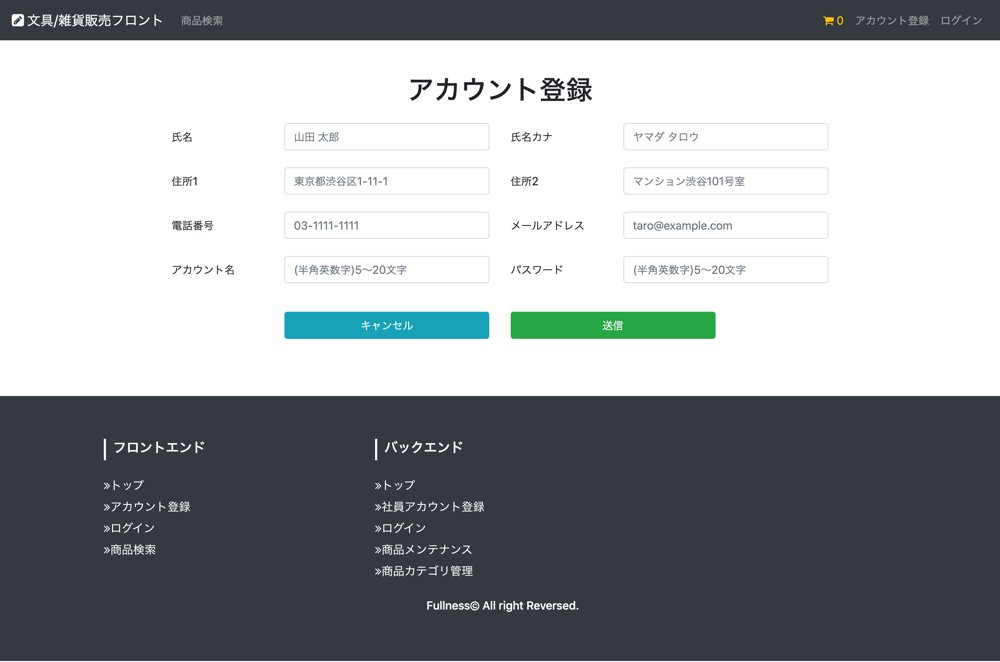
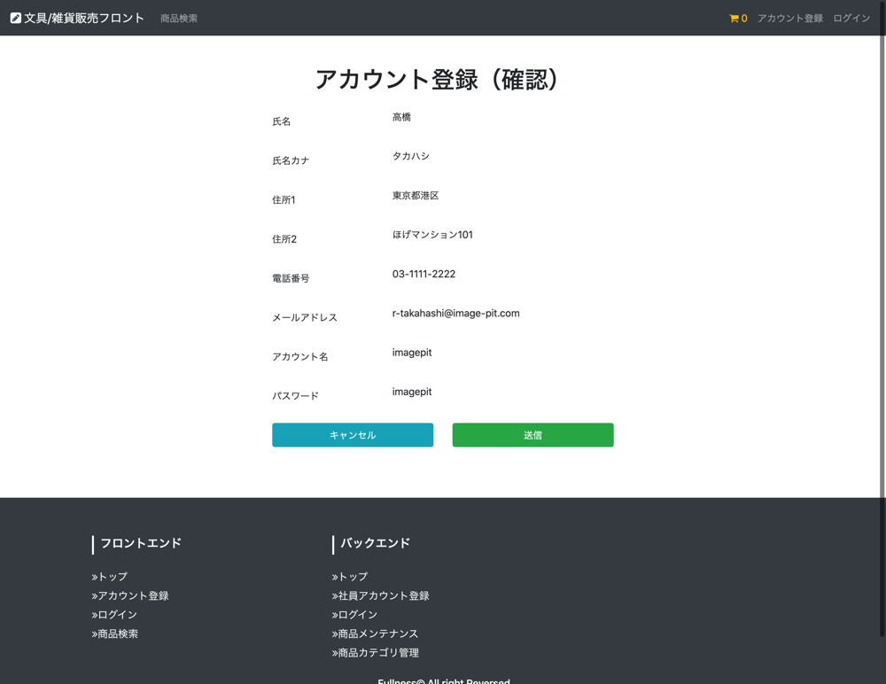
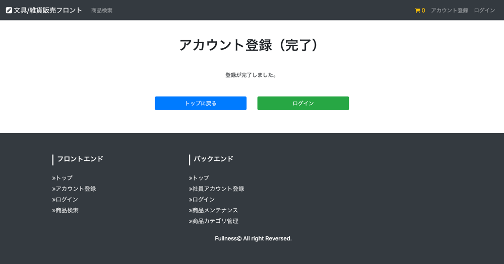

# UC001 顧客アカウント登録機能

## 概要

顧客が商品購入するために必要な情報をシステムに登録する

## 画面仕様

### アカウント登録（入力）画面

### アカウント登録（確認）画面

### アカウント登録（完了）画面

## 事前条件

- 顧客はまだログインしていない状態であること

## イベントフロー

1. 顧客はヘッダー部分の「アカウント登録」リンクを押下する
2. システムは「アカウント登録(入力)」画面を表示する
3. 顧客はアカウント登録する社員を選択する
4. 顧客は登録に必要な情報を画面に入力して「完了」ボタンを押下する
5. システムは「アカウント登録(確認)」画面を表示する
6. 顧客は入力内容に間違いが無ければ「登録」ボタンを押下する
7. システムはアカウント用IDを新規に発行しパスワードをハッシュ値化してシステムに登録する
8. システムは「アカウント登録(完了)」画面を表示する
9. ユースケース終了

## 代替フロー

- 6のイベントフローにおいて入力に誤りがあった場合「戻る」ボタン押下で「アカウント登録(入力)」 画面に戻る
  - 戻った後の入力画面は入力した内容が残っている
  - 顧客はイベントフロー3を再度実行する
- 6のイベントフローにおいて「キャンセル」ボタン押下で「メニュー」 画面に戻る
  - 入力した内容が破棄される

## 事後条件

ログイン認証してログイン後に許可された機能を利用できる

## 例外シナリオ:

- イベントフロー4において入力内容が備考の制約に違反した場合はエラーメッセージを画面に表示して再度入力を促す

## 備考

**入力値の制約**

項目|必須|文字数|文字種
---|---|---|---
氏名|◯|2〜20文字|全角半角英数字
氏名カナ|◯|2〜20文字|全角カナ
住所1|◯|〜100文字|全角半角英数字記号
住所2|-|〜100文字|全角半角英数字記号
電話番号|◯|〜14文字|数字2桁-数字4桁-数字4桁
メールアドレス|◯|4〜100文字|メールアドレス形式
アカウント名|◯|5〜20文字|半角英数字
パスワード|◯|5〜20文字|半角英数字5〜20文字