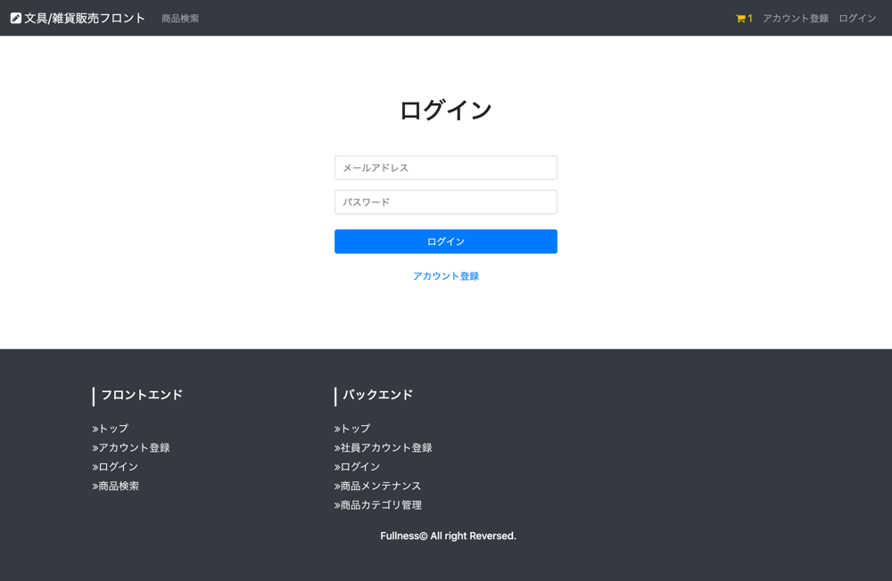
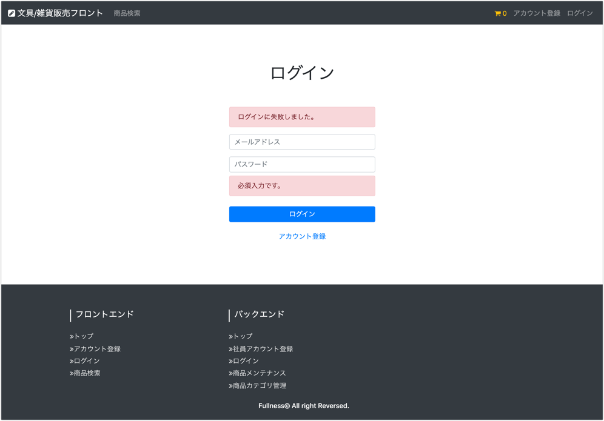

# UC002 顧客アカウントログイン機能

## 概要

顧客が商品購入のためにログインする

## 画面仕様

### ログイン画面

_ログイン時_

_ログインエラー時_

## 事前条件

- 顧客はまだログインしていない状態であること

## イベントフロー

1. 顧客はヘッダー部分から「ログイン」のリンクを押下する
2. 顧客はメールアドレスとパスワードを入力してログインボタンを押下する
3. 認証成功したらトップ画面へリダイレクトする

## 代替フロー

## 事後条件

- ログイン認証してシステムを利用することが可能になる

## 例外シナリオ:

- イベントフロー2においてログイン失敗した場合はエラーメッセージを画面に表示して再度入力を促す

## 備考

**入力値の制約**

項目|必須|文字数|文字種
---|---|---|---
メールアドレス|◯|-|
パスワード|◯|-|