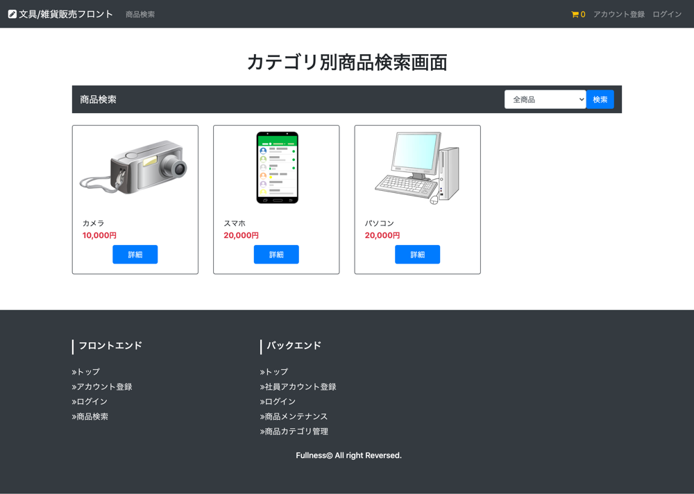

# UC003 カテゴリ別商品検索

## 概要

カテゴリを選択でき検索ボタンを押下するとカテゴリ別の商品検索が表示される

## 画面仕様

### カテゴリ別商品検索画面

_該当するカテゴリの商品がなかった場合_

## 事前条件

なし（顧客は未ログインでも利用できる）

## イベントフロー

1. 顧客はヘッダーの「商品検索」リンクを押下する
2. 顧客は商品カテゴリのプルダウンを選択し検索ボタンを押下する
3. 選択した商品カテゴリの商品が表示される

## 代替フロー

なし

## 事後条件

なし

## 例外シナリオ:

- イベントフロー2において該当する商品カテゴリの商品がなかった場合はメッセージを表示させる

## 備考

なし