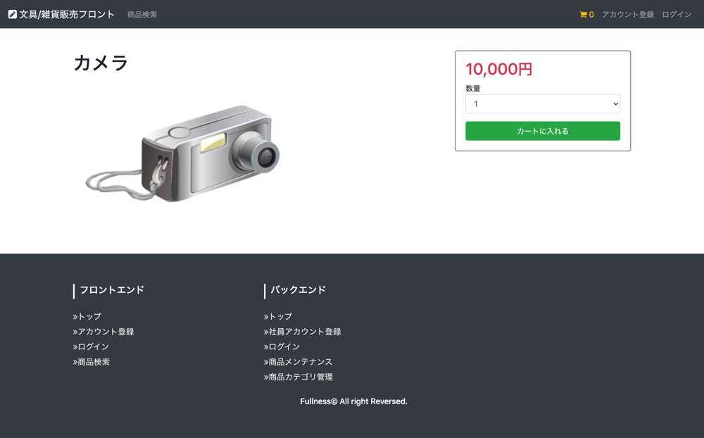
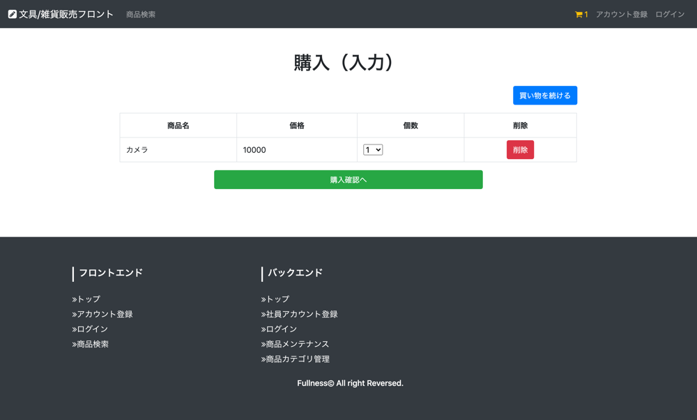

# UC004 商品購入

## 概要

購入希望の商品をカートに入れる

## 画面仕様

### 商品詳細画面

### カート画面

## 事前条件

なし（顧客は未ログインでも利用できる）

## イベントフロー

1. 顧客は商品カテゴリ検索画面で購入したい商品を押下する
2. 商品詳細画面が表示され購入希望の場合に「数量」を指定し「カートに入れる」ボタンを押下する
3. カート画面表示されカートに入れた商品、数量が表示される、それを顧客は確認する
4. ユースケース終了

## 代替フロー

なし

## 事後条件

なし

## 例外シナリオ:

- 指定した数量がDBの在庫量を上回った場合にエラーメッセージを表示させる

## 備考

**入力仕様**

_商品詳細画面_

- 数量のプルダウンはDBの在庫量の数を一つずつ選択できるようにする

_カート画面_

- 数量のプルダウンはDBの在庫量の数を一つずつ選択できるようにする