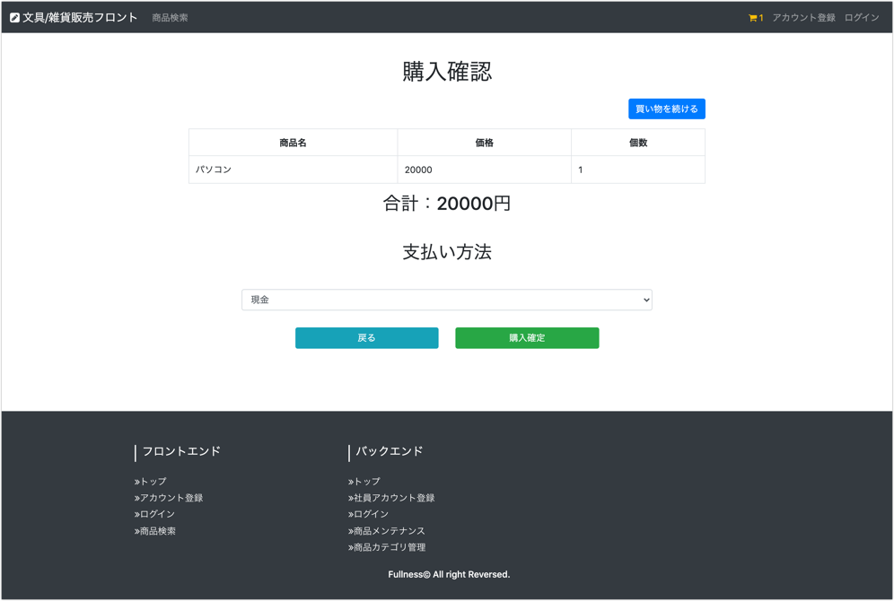
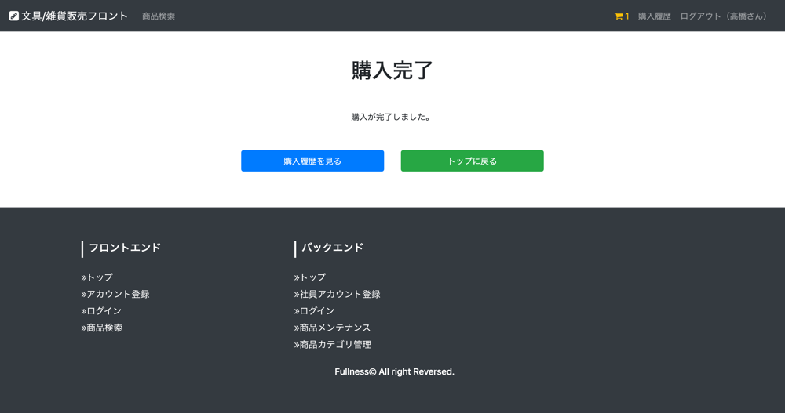

# UC005 購入確定

## 概要

カートの中に入れた購入内容を確認して確定させる

## 画面仕様

### 購入確認画面

### 購入完了画面

## 事前条件

- 顧客アカウントでログイン認証していること（※）
  - **前の画面（U004）の箇所で未ログインの場合ログイン画面を表示させる**
    - **ログイン後は当該画面を表示する**

## イベントフロー

1. 顧客はヘッダ部分にあるカートのアイコンを押下してカート画面を表示する
2. 顧客はカート画面から「購入手続きへ」ボタンを押下する
3. 購入確認画面が表示されるので顧客は購入内容を確認する
4. 購入確認画面ではカートに入れた商品、数量及び合計金額が表示される
5. 支払い方法のプルダウンを選択する
   1. **現時点では「現金」のみ選択できるようにする**
6. 購入確定ボタンをクリックする
7. 購入完了画面が表示される
8. ユースケース終了

## 代替フロー

- 「戻る」ボタンをクリック時はカート画面に戻る
- 「買い物を続ける」ボタンをクリック時はカテゴリ別商品一覧画面へ遷移する

## 事後条件

なし

## 例外シナリオ:

なし

## 備考

**入力仕様**

- 数量のプルダウンはDBの在庫量の数を一つずつ選択できるようにする

