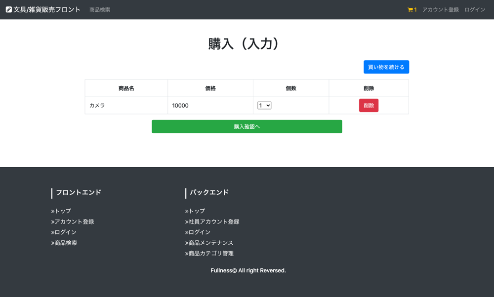

# UC006 購入キャンセル

## 概要

カートの中に入れた購入内容をキャンセルする

## 画面仕様

### カート画面

## 事前条件

なし（顧客は未ログインでも利用できる）

## イベントフロー

1. 顧客はヘッダ部分にあるカートのアイコンを押下する
2. カート画面にて購入した商品の「削除」ボタンを押下する
3. カート画面から削除した商品が削除される
4. ユースケース終了

## 代替フロー

なし

## 事後条件

なし

## 例外シナリオ:

なし

## 備考

なし
