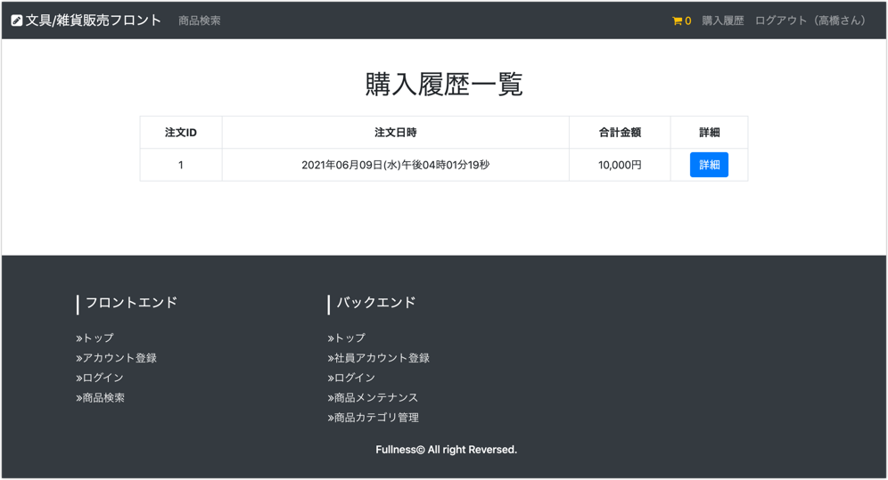
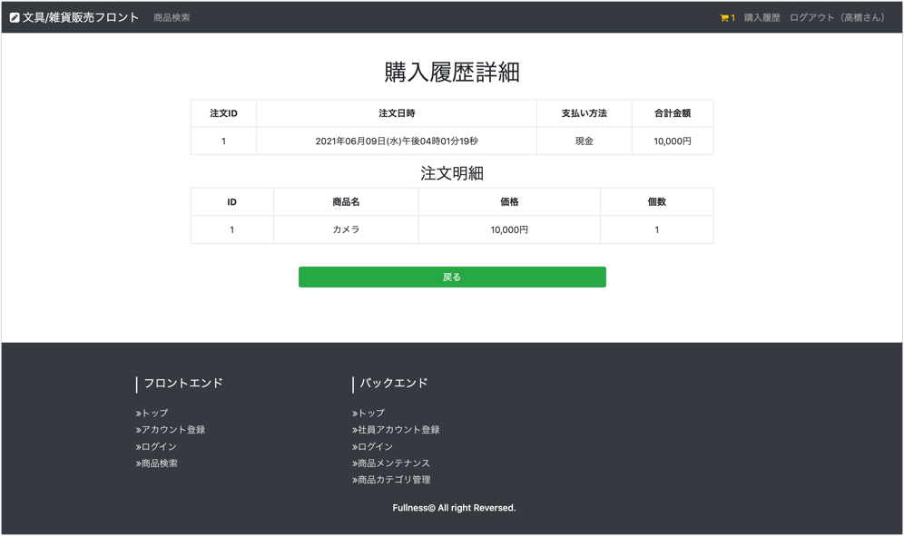

# UC007 購入履歴閲覧

## 概要

顧客が商品購入履歴を確認する

## 画面仕様

### 購入履歴一覧画面

### 購入履歴詳細画面

## 事前条件

顧客アカウントでログイン認証していること

## イベントフロー

1. 顧客はヘッダにある「購入履歴」リンクを押下する
2. 顧客は購入履歴一覧を確認する
3. 詳細を確認したい購入履歴の「詳細」ボタンをクリックする
4. 購入履歴詳細を確認する
5. ユースケース終了

## 代替フロー

なし

## 事後条件

なし

## 例外シナリオ:

なし

## 備考

- 購入履歴詳細画面にて「戻る」ボタンをクリックしたら購入履歴一覧画面へ遷移する
