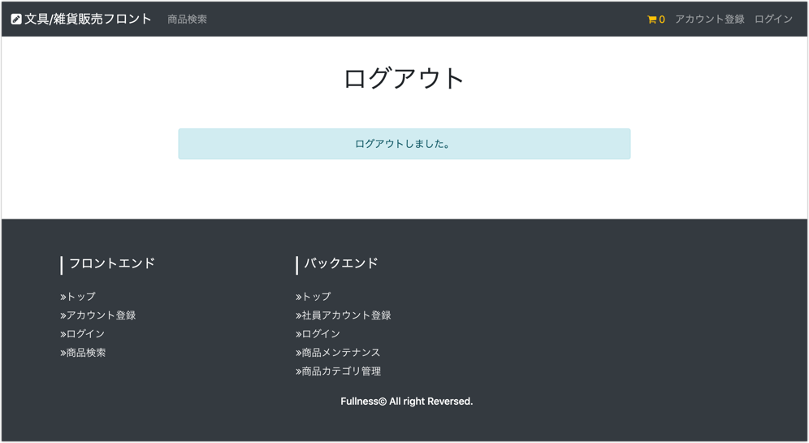

# UC008 顧客アカウントログアウト

## 概要

顧客が商品購入内容を確認する

## 画面仕様

### ログアウト画面

## 事前条件

顧客アカウントでログイン認証していること

## イベントフロー

1. 顧客はヘッダ部分の「ログアウト」のリンクを押下する
2. ログアウト画面が表示される
3. ユースケース終了

## 代替フロー

なし

## 事後条件

なし

## 例外シナリオ:

なし

## 備考

- ログアウト時はその顧客のセッションが破棄される
  - **カートの情報は保持する**
