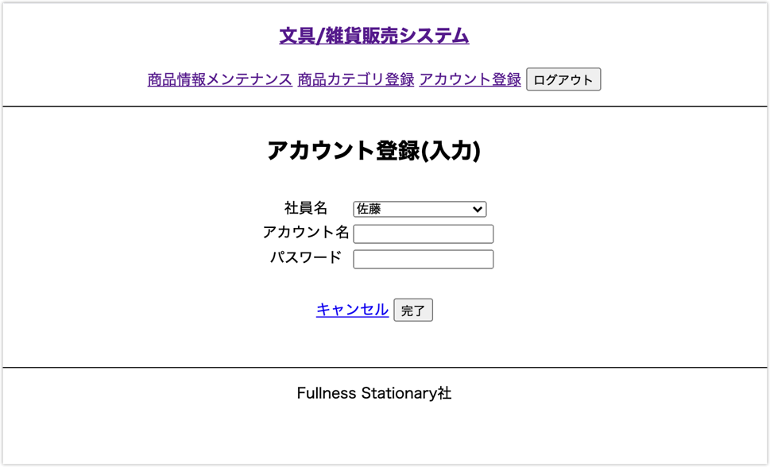
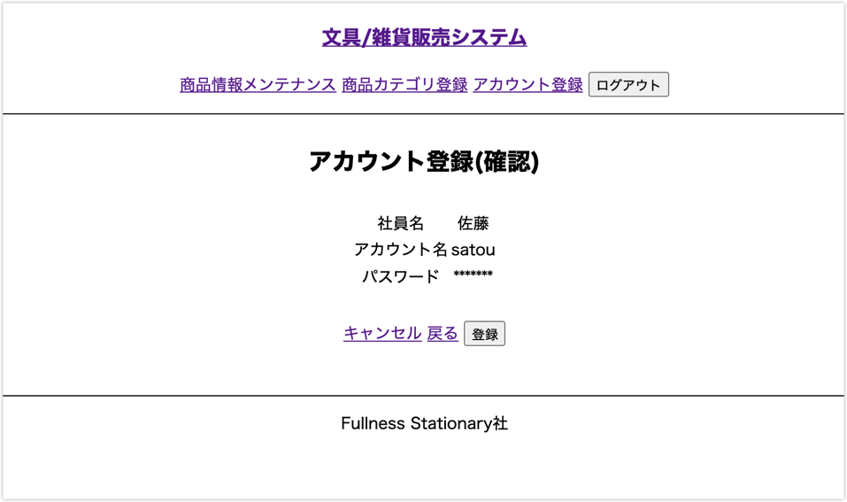

# UC009 担当者アカウント登録機能

## 概要

担当者がシステムを利用するために必要な情報をシステムに登録する

## 画面仕様

### 担当者アカウント登録（入力）画面

_入力エラー時_

### 担当者アカウント登録（確認）画面

### 担当者アカウント登録（完了）画面

## 事前条件

特になし

## イベントフロー

1. 担当者は「担当者アカウント登録」を選択する
2. システムは「アカウント登録(入力)」画面を表示する
3. 担当者はアカウント登録する社員を選択する
4. 担当者は登録に必要な情報を画面に入力して「完了」ボタンを押下する
5. システムは「アカウント登録(確認)」画面を表示する
6. 担当者は入力内容に間違いが無ければ「登録」ボタンを押下する
7. システムはアカウント用IDを新規に発行しパスワードをハッシュ値化してシステムに登録する
8. システムは「アカウント登録(完了)」画面を表示する
9. ユースケース終了

## 代替フロー

- 6のイベントフローにおいて入力に誤りがあった場合「戻る」ボタン押下で「アカウント登録(入力)」 画面に戻る
  - 戻った後の入力画面は入力した内容が残っている
  - 担当者はイベントフロー3を再度実行する
- 6のイベントフローにおいて「キャンセル」ボタン押下で「メニュー」 画面に戻る
  - 入力した内容が破棄される

## 事後条件

UC017【担当者ログイン】でログイン認証してシステムを利用することが可能になる

## 例外シナリオ:

- イベントフロー4において入力内容が備考の制約に違反した場合はエラーメッセージを画面に表示して再度入力を促す

## 備考

**入力値の制約**

項目|必須|文字数|文字種
---|---|---|---
社員名|◯|―|-
アカウント名|◯|5〜20文字|英数字
パスワード|◯|4〜10文字|英数字