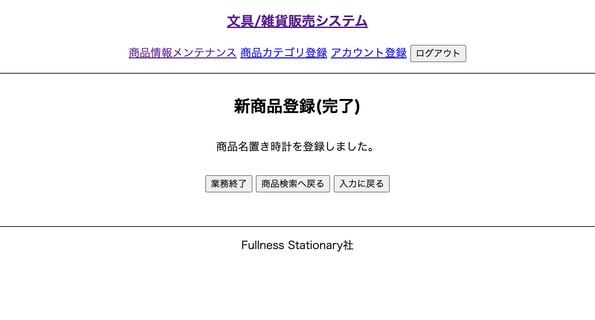

# UC010 新商品追加機能

## 概要

新しい商品の情報をシステムに登録する

## 画面仕様

### 新商品登録(入力)画面

### 新商品登録(確認)画面

### 新商品登録(完了)画面

## 事前条件

UC017【担当者ログイン】が終了している

## イベントフロー

1. 担当者は「商品情報メンテナンス」を選択する
2. システムは「商品情報メンテナンス」画面を表示する
3. 担当者は「新商品登録」ボタンを押下する
4. システムは「新商品登録(入力)」画面を表示する
5. 担当者は必要な情報を入力画面に入力して「完了」ボタンを押下する
6. システムは「新商品登録(確認)」画面を表示する
7. 担当者は入力内容を確認して「登録」ボタンを押下する
8. システムは商品IDを発行し新商品をシステムに登録する
9. システムは「新商品登録(完了)」画面を表示する
10. ユースケース終了

## 代替フロー

- イベントフロー7において入力に誤りがあった場合「戻る」ボタン押下で「新商品登録(入力)」画面に戻る
  - 戻った後の入力画面は入力した内容が残っている
  - 担当者はイベントフロー5を再度実行する
- イベントフロー7において「キャンセル」ボタン押下で「メニュー」 画面に戻る
  - 入力した内容が破棄される

## 事後条件

UC011【商品検索】で登録した新商品を確認することができる

## 例外シナリオ

- イベントフロー5において入力内容が備考の制約に違反した場合はエラーメッセージを画面に表示して再度入力を促す

## 備考

### 入力値の制約

項目|必須|文字数|文字種
---|---|---|---
商品名|◯|5〜20文字|全角・半角英数字記号
単価|◯|2〜10文字|数字
在庫数|◯|0〜1000000|数字 
商品カテゴリ|◯|-|-
画像|◯|-|-

### 単価の制約

カテゴリ別に商品単価は以下の制約条件になる

商品カテゴリ|単価
---|---
文房具|30円〜5000円
雑貨|100円〜10000円
パソコン周辺機器|300円〜30000円

