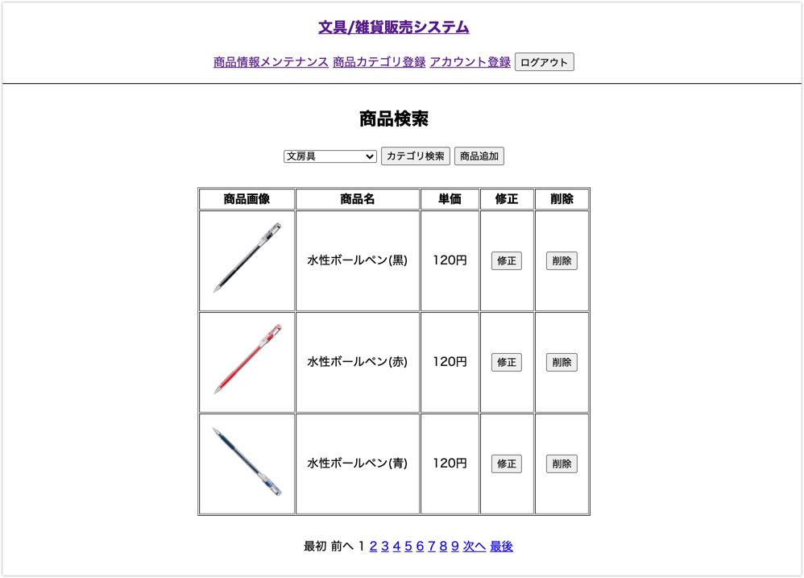
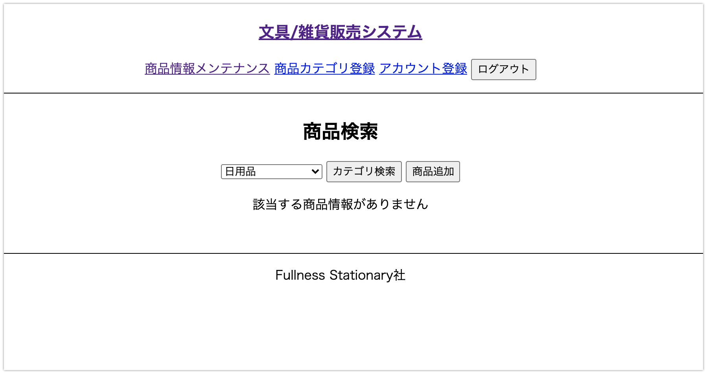

# UC011 商品検索

## 概要

選択された商品カテゴリに属する商品を一覧表示する

## 画面仕様

### 商品検索画面

_検索結果0件時_

## 事前条件

UC017【担当者ログイン】が終了している

## イベントフロー

1. 担当者は「商品情報メンテナンス」を選択する
2. システムは「商品情報メンテナンス」画面を表示する
3. 担当者は「商品カテゴリ」を選択し「検索」ボタンを押下する
4. システムは検索結果を一覧表示する
   1. 結果表示後は選択した商品カテゴリがプルダウンで選択されている
5. ユースケース終了

## 代替フロー
 
なし

## 事後条件

なし

## 例外シナリオ

なし

## 備考

なし