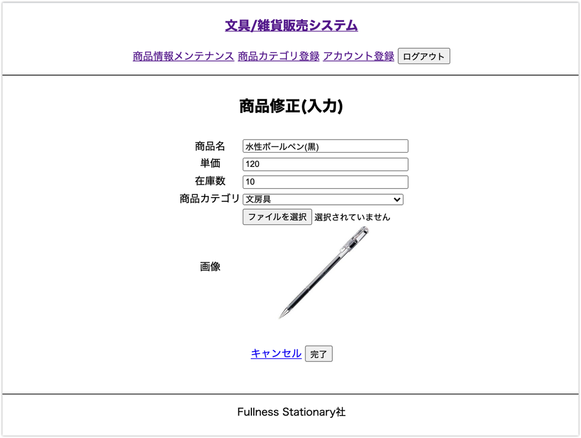
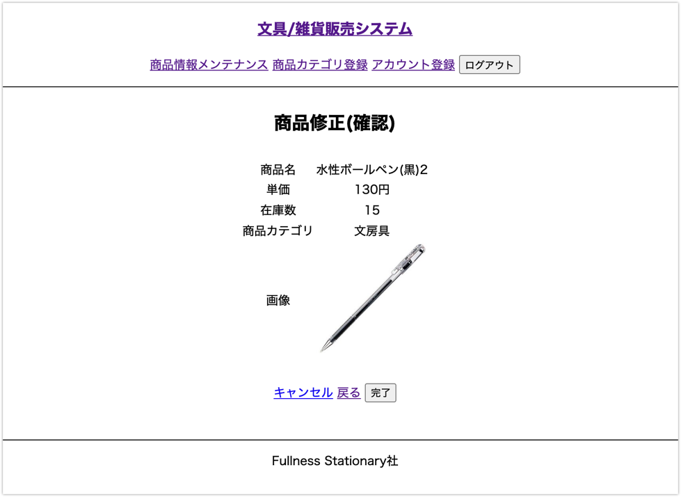
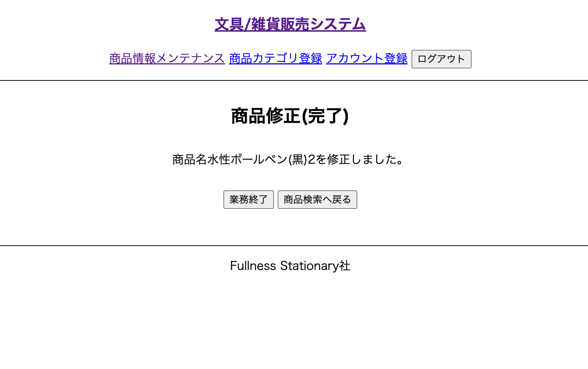

# UC012 商品修正

## 概要

選択された商品の内容を変更する

## 画面仕様

### 商品修正（入力）画面

### 商品修正（確認）画面

### 商品修正（完了）画面

## 事前条件

UC017【担当者ログイン】が終了している UC011【商品検索】で商品の一覧が表示されている

## イベントフロー

1. 担当者は変更対象の商品情報の「変更」ボタンを押下する
2. システムは「商品修正(入力)」画面を表示する
3. 担当者は変更項目を入力して「完了」ボタンを押下する
4. システムは「商品修正(確認)」画面を表示する
5. 担当者は変更内容を確認して「登録」ボタンを押下する
6. システムは商品情報を入力された内容で変更し「商品修正(完了)」画面を表示する
7. ユースケース終了

## 代替フロー

- イベントフロー5において変更に誤りがあった場合「戻る」ボタン押下で「商品修正(入力)」画面 に戻る
  - 戻った後の入力画面は入力した内容が残っている
  - 担当者はイベントフロー3を再度実行する
- イベントフロー5において「キャンセル」ボタン押下で「商品検索」 画面に戻る
  - 入力した内容が破棄される

## 事後条件

なし

## 例外シナリオ

- イベントフロー3おいて入力内容が備考の制約に違反した場合はエラーメッセージを画面に表示して再度入力を促す

## 備考

入力に関する制約はUC010と同じ

