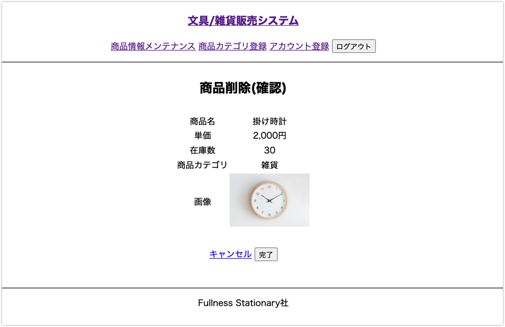

# UC013 商品削除

## 概要

選択された商品を削除する

## 画面仕様

### 商品削除(確認)画面

### 商品削除(完了)画面

## 事前条件

UC017【担当者ログイン】が終了している UC011【商品検索】で商品の一覧が表示されている

## イベントフロー

1. 担当者は削除対象の商品情報の「削除」ボタンを押下する
2. システムは「商品削除(確認)」画面を表示する
3. 担当者は内容を確認して「削除」ボタンを押下する
4. システムは商品を削除し「商品削除(完了)」画面を表示する
5. ユースケース終了

## 代替フロー

なし

## 事後条件

なし

## 例外シナリオ

なし

## 備考

商品情報は過去の履歴検索等で利用するため物理削除は行わない

