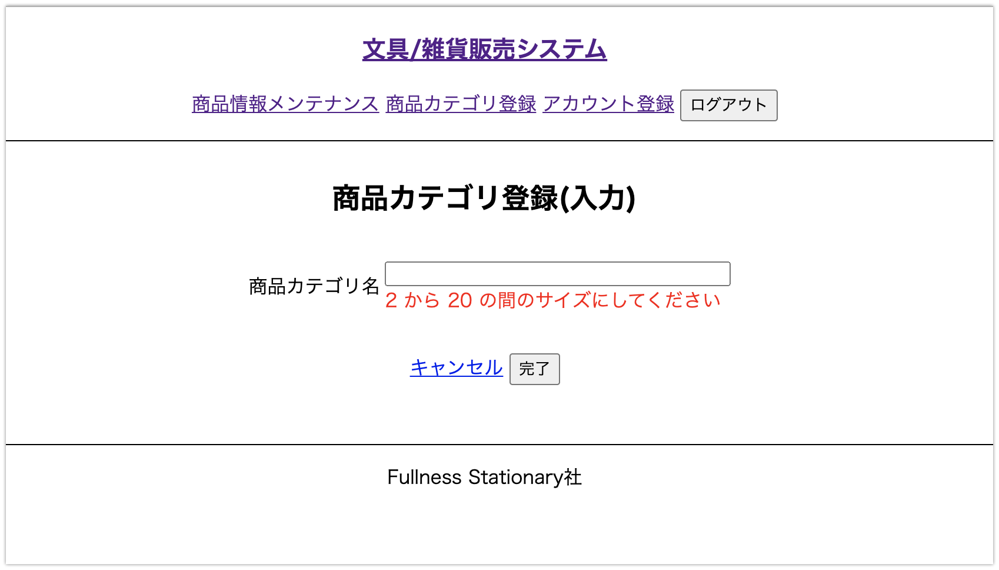

# UC014 商品カテゴリ登録

## 概要

新しい商品カテゴリを登録する

## 画面仕様

### 商品カテゴリ登録(入力)画面

_入力エラー時_

### 商品カテゴリ登録(確認)画面

### 商品カテゴリ登録(完了)画面

## 事前条件

UC017【担当者ログイン】が終了している

## イベントフロー

1. 担当者は「カテゴリ登録」を選択する
2. システムは「カテゴリ登録(入力)」画面を表示する
3. 担当者はカテゴリ名を入力して「完了」ボタンを押下する
4. システムは「カテゴリ登録(確認)」画面を表示する
5. 担当者は入力内容を確認して「登録」ボタンを押下する
6. システムはカテゴリIDを発行しカテゴリをシステムに登録する
7. システムは「カテゴリ登録(確認)」画面を表示する
8. ユースケース終了

## 代替フロー

- イベントフロー5において入力に誤りがあった場合「戻る」ボタン押下で「カテゴリ登録(入力)」 画面に戻る
  - 戻った後の入力画面は入力した内容が残っている
  - 担当者はイベントフロー3を再度実行する
- イベントフロー5において「キャンセル」ボタン押下で「メニュー」 画面に戻る
  - 入力した内容が破棄される

## 事後条件

UC011【商品検索】で登録されたカテゴリを選択することができる

## 例外シナリオ

- イベントフロー3.において入力内容が備考の制約に違反した場合はエラーメッセージを画面に表示して再度入力を促す

## 備考

**入力値の制約**

項目|必須|文字数|文字種
---|---|---|---
カテゴリ名|◯|2〜20文字|全角漢字ひらがな英数字、半角英数字

