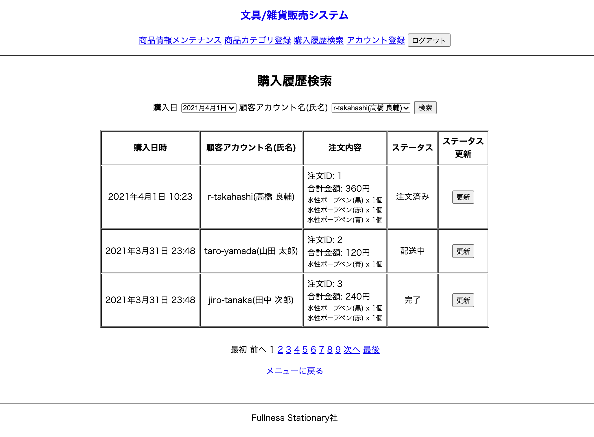
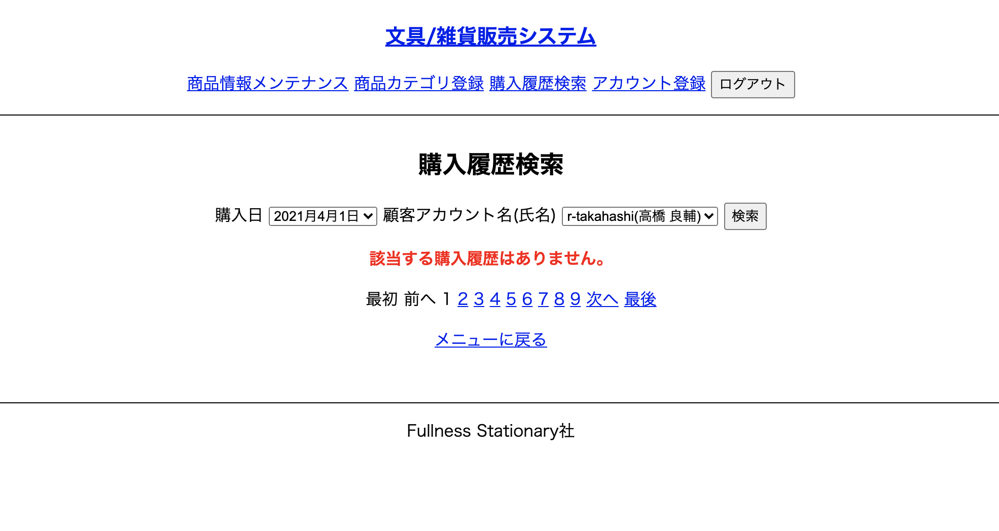

# UC015 購入履歴検索

## 概要

検索条件に一致する購入履歴を検索し一覧表示する

## 画面仕様

_検索結果が0件の場合_

## 事前条件

UC017【担当者ログイン】が終了している

## イベントフロー

1. 担当者はヘッダーの「購入履歴検索」を選択する
2. システムは「購入履歴検索」画面を表示する
   1. 初期表示では注文履歴の全件が表示されている
3. 担当者は「購入日」又は「顧客アカウント名」のいずれかまたは両方を入力して「検索」ボタンを押下する
4. システムは条件に一致する購入情報を検索して一覧表示する
5. ユースケース終了

## 代替フロー

なし

## 事後条件

なし

## 例外シナリオ

- イベントフロー2および4において対象データがなかった場合データがないことを表すメッセージを表示する

## 備考

なし