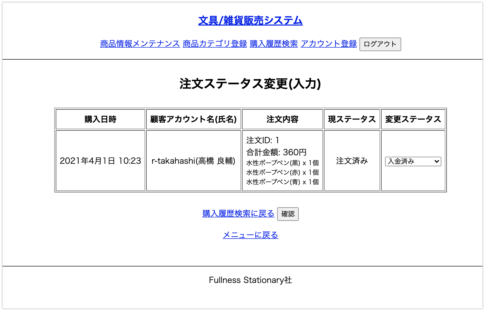
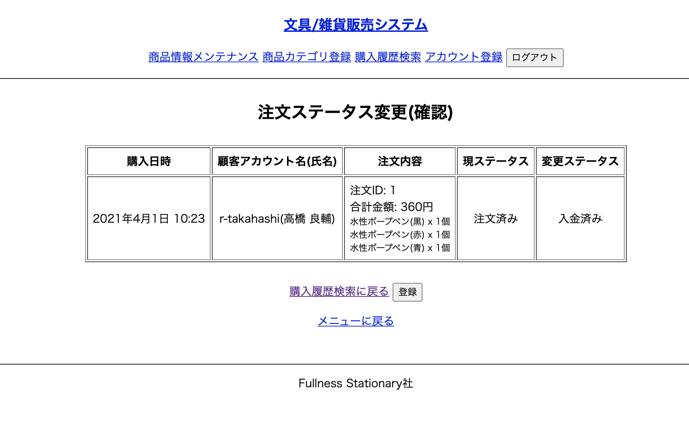
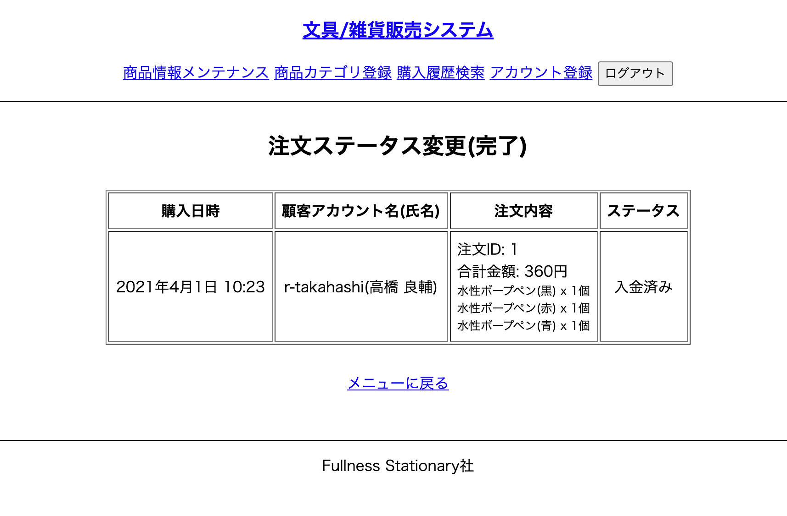

# UC016 注文ステータス更新

## 概要

注文のステータスを注文済みから、入金済み、配送中、完了に変更する

## 画面仕様

### 注文ステータス更新(入力)画面

### 注文ステータス更新(確認)画面

### 注文ステータス更新(完了)画面

## 事前条件

UC017【担当者ログイン】が終了している

## イベントフロー

1. 担当者は「購入履歴検索」画面から注文ステータスを変更したい注文を選択する
2. システムは「注文ステータス更新(入力)」画面を表示する
3. 担当者は注文ステータスを変更し「確認」ボタンを押下する
4. システムは「注文ステータス更新(確認)」画面を表示する
5. 担当者は注文ステータス変更ないようを確認し「登録」ボタンを押下する
6. システムは「注文ステータス更新(完了)」画面を表示する
7. ユースケース終了

## 代替フロー

なし

## 事後条件

なし

## 例外シナリオ

- イベントフロー4において対象データがなかった場合データがないことを表すメッセージを表示する

## 備考

なし