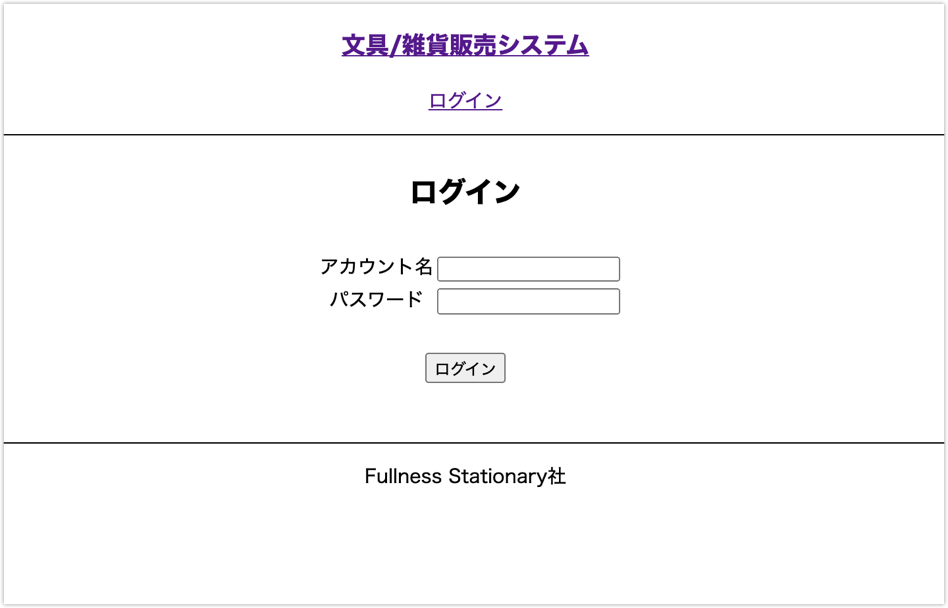
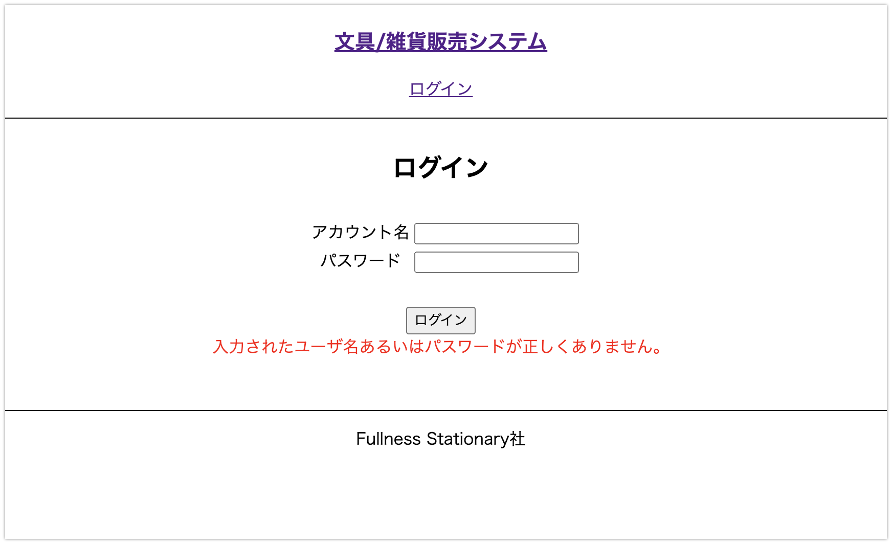
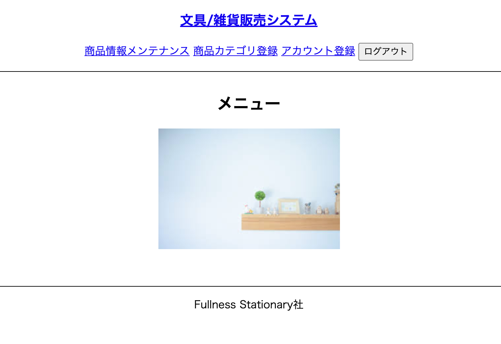

# UC017 担当者ログイン

## 概要

担当者がシステムを利用する権限を有しているか認証する

## 画面仕様

### 担当者ログイン画面

_ログイン前_

_ログインエラー時_

_ログイン後_

## 事前条件

UC009【担当者アカウント登録】が終了している

## イベントフロー

1. 担当者は「ログイン」を選択する
2. システムは「ログイン」画面を表示する
3. 担当者は「アカウント名」と「パスワード」を入力して「ログイン」ボタンを押下する
4. システムは入力された「アカウント名」と「パスワード」で認証処理を行い「メニュー(ログイン後)」画面を表示する
5. ユースケース終了

## 代替フロー

なし

## 事後条件

他のユースケースをメニューから選択できる

## 例外シナリオ

- イベントフロー3において「アカウント名」又は「パスワード」のいずれか、又は両方が未入力の場合、エラーメッセージを画面に表示し再入力を促す
- イベントフロー4において「アカウント名」又は「パスワード」のいずれか又は両方が間違っていた場合、エラーメッセージを画面に表示し再入力を促す

## 備考

入力の制約条件[UC009](uc009.md)と同じ